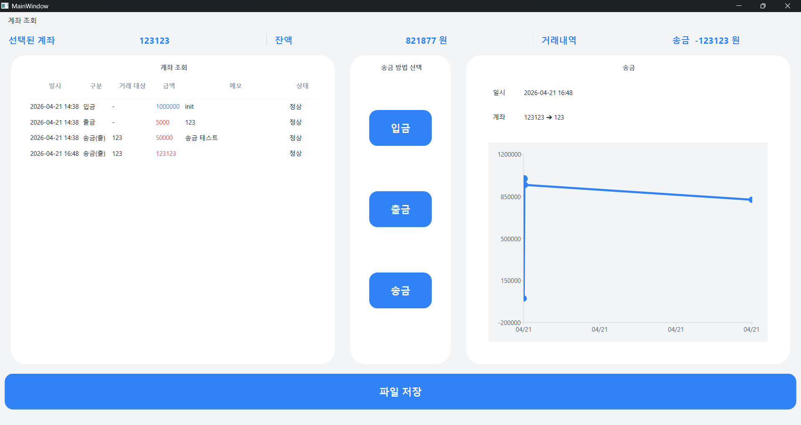
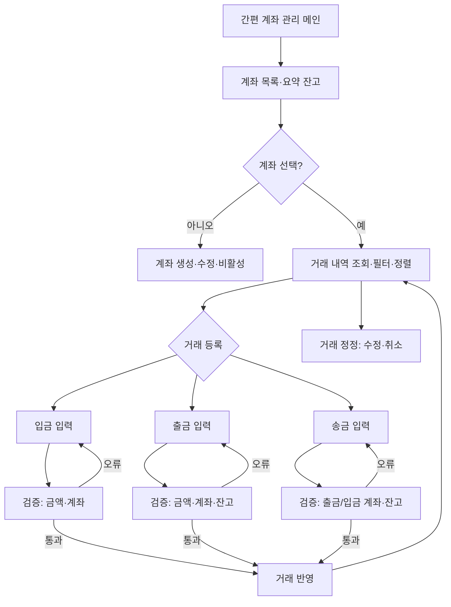

# VEDA_Side_Project

VEDA 5주차 20-22일 Qt 사이드 프로젝트

---

# SideProject — 계좌 관리 앱 (Toss Edition)

Qt6 / C++17 기반의 개인 계좌 관리 데스크톱 애플리케이션입니다. 

> [!IMPORTANT]
> **2026-04-21 리디자인 완료**: 사용자 경험 극대화를 위해 토스(Toss)의 라이트 테마(화이트 카드, 둥근 모서리, 고대비 타이포그래피)를 전면 적용했습니다. 

기존의 입금·출금·송금 기능을 보다 직관적인 UI로 다듬었으며, 모던한 그래프 표현력을 통해 계좌 관리의 가독성을 최상으로 끌어올렸습니다.

> [!NOTE]
> **Network 브랜치 기능**: 동일 Wi‑Fi(LAN) 환경에서 **TCP 기반 동기화 데모**를 지원합니다. 한 PC를 서버로 실행하면, 다른 PC들이 접속해 계좌/송금 상태가 자동으로 갱신됩니다.

---

## 📸 스크린샷




---

## 🚀 주요 기능

| 기능 | 설명 |
|------|------|
| **계좌 관리** | 새로운 계좌 생성 및 보안 비밀번호 설정, 계좌 삭제 기능 |
| **입금 & 출금** | 팝업 다이얼로그 기반의 직관적인 뱅킹 시스템. 출금 시 잔액 검증 방어 로직 가동 |
| **송금 (이체)** | 출금 계좌와 입금 계좌 양방향 로그의 원자성(Atomicity) 보장. 거래 대상(Counterparty) 기능 추가 |
| **거래 내역 & 잔고** | 대상 계좌별 거래 내역 실시간 테이블 추적. `QSortFilterProxyModel` 기반의 즉각적 뷰어 동기화 |
| **실시간 차트 분석** | Qt Charts 라이브러리를 활용한 계좌 자금 변동 내역 시각화 (동적 Min/Max 스케일링 자동 계산 지원) |
| **강력한 데이터 보존** | JSON 기반 영속성 저장 시스템 기능 및 **오염된 고아(Zombie) 거래내역을 로드 시 자동 폐기하는 `Self-Healing` 무결성 보장 로직** 탑재 |
| **LAN 동기화 (TCP)** | `Sync` 메뉴에서 서버/클라이언트로 동작. 서버가 정본을 저장하고, 클라이언트는 변경 알림(`changed`)을 받으면 상태를 재동기화 |

---

## 🌐 LAN 동기화 데모 (Network 브랜치)

- 서버 PC: 앱 실행 → 메뉴 `Sync` → `Start Server (LAN)` → 포트(기본 `7777`)
- 클라이언트 PC: 앱 실행 → 메뉴 `Sync` → `Connect To Server...` → 서버 PC의 IP + 포트 `7777`
- 동기화: 다른 PC에서 계좌 생성/송금하면, 연결된 모든 클라이언트가 자동으로 최신 상태로 갱신됩니다.
- 주의: Windows 방화벽에서 해당 포트(`7777/TCP`) 인바운드 허용이 필요할 수 있습니다.
- 참고: 클라이언트 모드에서는 로컬 저장(`Save`)을 비활성화하고, 서버가 `account_info.json`을 관리합니다.

---

## 📊 시스템 흐름도



---

## 🛠 프로젝트 구조

> 단일 `MainWindow` 아키텍처에 기초하되 다양한 팝업 UI 창 모듈과 비즈니스 로직(`BankManager`)이 결합된 구조입니다.

```text
SideProject_Account/
├── main.cpp
├── mainwindow.h / cpp         # 메인 뷰어 및 UI 허브 (Qt 차트 렌더링, JSON 로드/세이브 등)
├── bankmanager.h / cpp        # 핵심 데이터 비즈니스 로직 매니저 (송금 및 연산 통제)
├── account.h / cpp            # 계좌(AccountModel) 데이터와 내부 Qt 모델 클래스 (QAbstractListModel)
├── transaction.h / cpp        # 거래 내역(TransactionModel) 데이터와 내부 Qt 모델 클래스 (QAbstractTableModel)
├── UI Layouts/
│   ├── mainwindow.ui          # 통합 메인 뷰어
│   ├── add_acc.ui / delete_acc.ui / Acc_search.ui
│   ├── deposit.ui / withdraw.ui / transfer.ui  # 입금, 출금, 송금 팝업
├── Dialog Controllers/                   
│   ├── AddAccDialog.h / cpp
│   ├── DeleteAccDialog.h / cpp
│   ├── DepositDialog.h / cpp
│   ├── WithdrawDialog.h / cpp
│   ├── TransferDialog.h / cpp # 신규 추가된 통합 송금 다이얼로그 모듈
└── CMakeLists.txt             # 빌드 컴파일 명세 파일
```

---

## 💾 데이터 모델 로직 (JSON DB)

### Account (계좌)
- `id` : 내부 고유 식별자 (`BankManager` 내부 발급 번호)
- `accountNumber` : 계좌 번호 (조회용 PK 역할)
- `password` : 결제 인증용 비밀번호 (인증 기능 추가)
- `initialBalance` / `currentBalance` : 최초 개설 잔고 및 계산된 현재 잔여 잔고 반영 치
- `createdAt` : 계좌 개설 일시

### Transaction (거래 내역)
- `id` : 거래 고유 번호
- `accountId` : 거래가 속한 원본 계좌의 식별자
- `type` : `Deposit`, `Withdraw`, `TransferOut`, `TransferIn`
- `status` : `Posted` (정상 거래), `Canceled` (삭제된 계좌의 파기된 거래)
- `counterpartyAccount` : 송금 및 이체 시 상대방 계좌 번호 정보 보존
- `occurredAt` : 거래 발생 일시

---

## ⚙️ 빌드 및 실행 환경

- **UI Framework** : Qt 6.5+ (진입점: Qt Widgets, Qt Charts, Qt Network)
- **C++ Standard** : C++17
- **Build System** : CMake 3.19+ (MinGW 32-make)
- **IDE** : Qt Creator

```bash
mkdir build
cd build
cmake ..
cmake --build .
```

---

## 📜 라이선스

Personal side project — All rights reserved.
